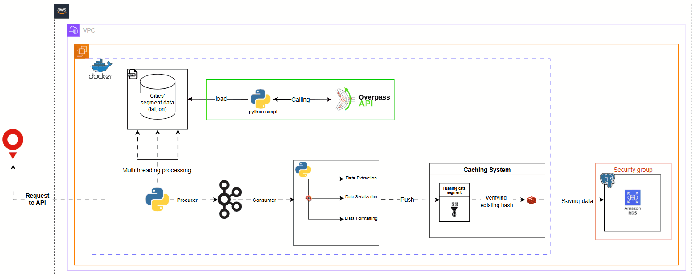

# 🚦 Advanced Real-Time Traffic ETL Pipeline

## 🌍 Project Description

This project is an advanced ETL (Extract, Transform, Load) pipeline designed to collect real-time traffic data from major cities around the world.

It combines **OpenStreetMap’s Overpass API** and **TomTom’s Traffic API** to extract live traffic conditions on road segments. The system is designed to:
- **Extract** road segments (latitude/longitude) using Overpass API.
- **Query** TomTom API for real-time traffic data on those segments.
- **Transform** the JSON responses into structured format.
- **Load** the processed data into an AWS RDS cloud database.

The pipeline is scalable, modular, and optimized for cloud deployment.

---

## 🛠️ Technologies Used

- 🛰️ **Overpass API** – for querying geographical road segment data
- 🛣️ **TomTom Traffic API** – for real-time traffic information (e.g., congestion, delay)
- 🐍 **Python** – for scripting ETL workflows
- ☁️ **AWS RDS** – as the target database for storing cleaned traffic data
- 🐘 **PostgreSQL** – database engine for storing and querying traffic data
- 🧠 **Apache Kafka**  – for Data Streaming
- 🐳 **Docker** – for containerization and deployment
- 📦 **Redis** – for Caching Data
---

